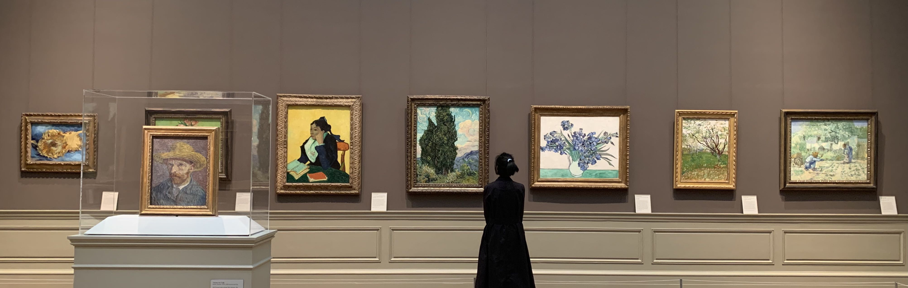

Title: My Green World - The MET
Date: 2022-03-10 21:56
Category: Art
Tags: MET
Slug: my-green-world
Author: Iris
Summary: 大都会，永远的绿色世界。
lang: zh

怀着激动（疲惫）的心情，搭好站子，就要趁热发帖，顺便清清备忘录里的小作文。   

今天先讲讲大都会。以下写于大学毕业前夕【有删改】：

   
**********

毕业照是没有机会拍了，
如果想给大学生涯画上一个句号，我希望是和《两棵柏树》同框

MET，   
小时候是梦想中的圣地   
之后变成了追梦的动力   
现在是我的“第三大学”，游乐场，Green World   
以后将会是拼命赚钱想回到的地方   

12年初到 MET，那个时候才初一，第一次一个人跟团出国，   
还记得第一个晚上在洛杉矶，因为落单只能和老师一起住；半夜想家的时候只能一个人在被窝哭   
后来慢慢交到了朋友，进了 MET 就拉着她们去找梵高，说这是我的偶像   

我选择来美国，也许也是为了和大师们做邻居吧。   
不高兴的时候，总要找一个出口宣泄，   
MET 就是那个出口。   
不得不说，一到中国馆就有一种回家的感觉。   
可能艺术品中流露出的中国风本身就有一种凝聚力，甚至是治愈力。   
在一众永垂不朽的大师面前，现世的烦恼、焦虑微不足道。   
大师遥远璀璨如晨星，而我卑微、年轻、尚无所作为。   
我经历的迷茫，上千年来，恐怕人人都会经历吧。   
但是大师的气度，少有。我的格局太小。   

MET 就是这么神奇，转着看着，整个人就会开朗起来。   
想不明白的事情，走一圈也许就会有所感悟。有些事，就是那么巧。  

（附上和梵高爷爷整墙作品的合照）  

{: width="100%"}

